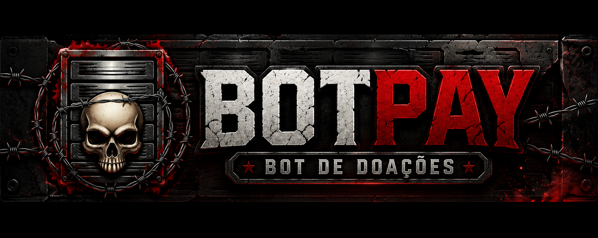
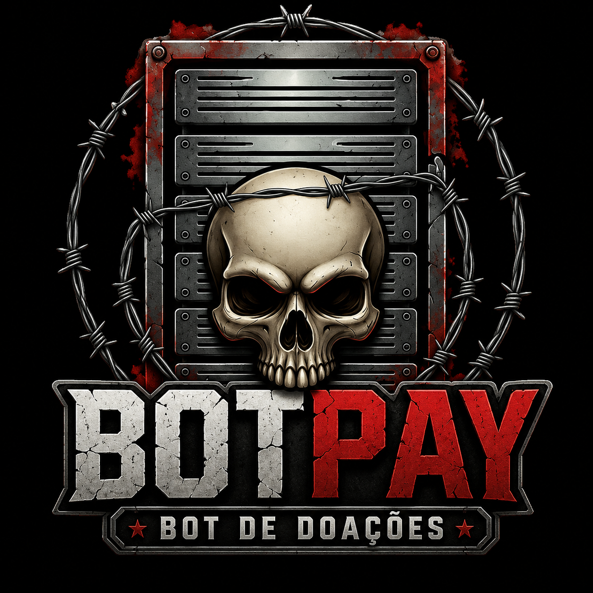
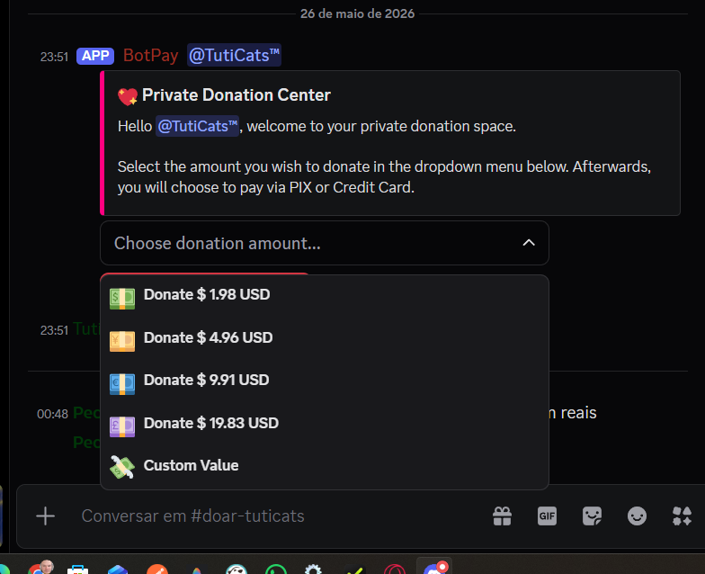
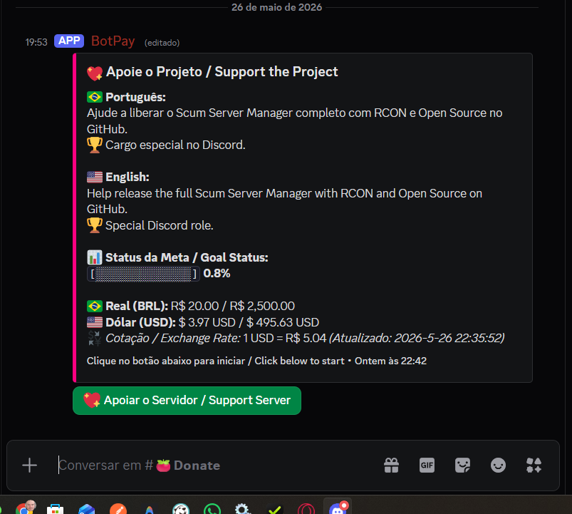

# 💖 BotPay - Discord Donation System

A complete donation bot for Discord servers with native support for **Mercado Pago (PIX)**, **Stripe (Credit Card)**, bilingual localization (Portuguese/English), and an integrated administrative panel.

<p align="center">
  
  
</p>

---

## 📸 Screenshots

<p align="center">
  
  
</p>

---

## 🚀 Key Features

*   **⚡ Automated Payments:**
    *   **Mercado Pago (PIX):** Automatically generates QR Codes and copy-paste codes directly in Discord, with a dynamic webhook URL needing no manual configuration on the provider dashboard.
    *   **Stripe (Credit Card):** Intelligent checkout links. Detects the user's region and charges in **Brazilian Real (BRL)** for Brazilian users (preventing payment declines on domestic cards like Elo) and in **US Dollars (USD)** with automatic exchange rate conversion for international users.
*   **🌐 Dynamic Bilingual Localization:**
    *   The bot detects the user's language based on server roles (PT/US Language roles) or their Discord client language settings.
    *   All ticket channels, thank-you DMs, receipts, and alert messages are translated automatically.
*   **📊 Public Goals Panel:**
    *   A pinned channel message updated in real-time showing monthly donation goal progress via visual progress bars.
*   **🛡️ Administrative Logs & Quick Approval Panel:**
    *   Every time a user initiates a donation flow, a detailed log embed is sent to the staff/admin channel.
    *   Includes a green `✅ Approve Payment` interactive button, allowing administrators to manually approve the donation with one click (updating goals, sending DMs, and granting the VIP role).
*   **🔧 Auto-Managed Infrastructure:**
    *   Silent installation of the Ngrok agent if not found on the host machine.
    *   Silent automatic updates for Ngrok upon startup to prevent connection errors due to obsolete versions (`ERR_NGROK_121`).

---

## 🛠️ Configuration Guide (`config.json`)

Edit the `config.json` file in the bot's root directory with the following variables:

```json
{
  "DISCORD_TOKEN": "YOUR_DISCORD_BOT_TOKEN",
  "DISCORD_CLIENT_ID": "YOUR_DISCORD_APPLICATION_CLIENT_ID",
  "MERCADOPAGO_ACCESS_TOKEN": "YOUR_MERCADO_PAGO_TOKEN",
  "STRIPE_SECRET_KEY": "YOUR_STRIPE_SECRET_KEY",
  "STRIPE_WEBHOOK_SECRET": "YOUR_STRIPE_WEBHOOK_SECRET_KEY",
  "PORT": 3000,
  "BASE_URL": "http://localhost:3000",
  "NGROK_AUTHTOKEN": "YOUR_NGROK_AUTHTOKEN",
  "DONATION_CHANNEL_ID": "ID_OF_THE_PUBLIC_DONATION_CHANNEL",
  "VIP_ROLE_ID": "ID_OF_THE_VIP_ROLE_TO_GIVE_UPON_DONATING",
  "LOG_CHANNEL_ID": "ID_OF_THE_ADMIN_LOG_AND_APPROVAL_CHANNEL",
  "DONATION_GOAL_BRL": 2500,
  "PREDEFINED_VALUES_BRL": [10, 25, 50, 100],
  "PANEL_TITLE": "💖 Apoie o Projeto / Support the Project",
  "PANEL_DESC_PT": "Ajude a liberar o Scum Server Manager completo com RCON e Open Source no GitHub.\n🏆 Cargo especial no Discord.",
  "PANEL_DESC_EN": "Help release the full Scum Server Manager with RCON and Open Source on GitHub.\n🏆 Special Discord role.",
  "PANEL_META_TITLE": "📊 **Status da Meta / Goal Status:**",
  "PANEL_BRL_LABEL": "🇧🇷 **Real (BRL):**",
  "PANEL_USD_LABEL": "🇺🇸 **Dólar (USD):**",
  "PANEL_EXCHANGE_LABEL": "💱 *Cotação / Exchange Rate:*",
  "PANEL_FOOTER": "Clique no botão abaixo para iniciar / Click below to start",
  "ROLE_ENGLISH_ID": "YOUR_ENGLISH_LANGUAGE_ROLE_ID",
  "ROLE_PORTUGUESE_ID": "YOUR_PORTUGUESE_LANGUAGE_ROLE_ID"
}
```

---

## 📦 How to Compile and Run

### 💻 Option A: Portable Executable (`.exe`) - Recommended for Servers
This option does not require Node.js, NPM, or the `node_modules` folder on your server. Everything is embedded inside the executable.

1. **On your development machine:**
   * Run the compile script:
     ```bash
     npm run build
     ```
   * This generates the standalone `botpay.exe` binary in the `dist/` directory.
2. **On your Production Server:**
   * Copy only `dist/botpay.exe` and `config.json` to the same folder on the server.
   * Double-click `botpay.exe`.
   * The bot will automatically install Ngrok if missing, build the secure webhook tunnel, and start up!

### ⚙️ Option B: Running directly with Node.js
Requires Node.js installed on the server.

1. Install dependencies:
   ```bash
   npm install --omit=dev
   ```
2. Start the bot:
   ```bash
   npm start
   ```

---

## 🎯 Available Slash Commands

*   `/setup` - Generates the pinned donation panel and goal status embed in the configured channel.
*   `/meta` - Displays the current monthly donation goal.
*   `/setmeta <value>` - Allows real-time modification of the monthly donation goal.
*   `/aprovar-doacao <id>` - Administrative command to manually approve any pending donation.

---

## 📜 License

This project is licensed under the [MIT License](LICENSE) - see the file for details.

